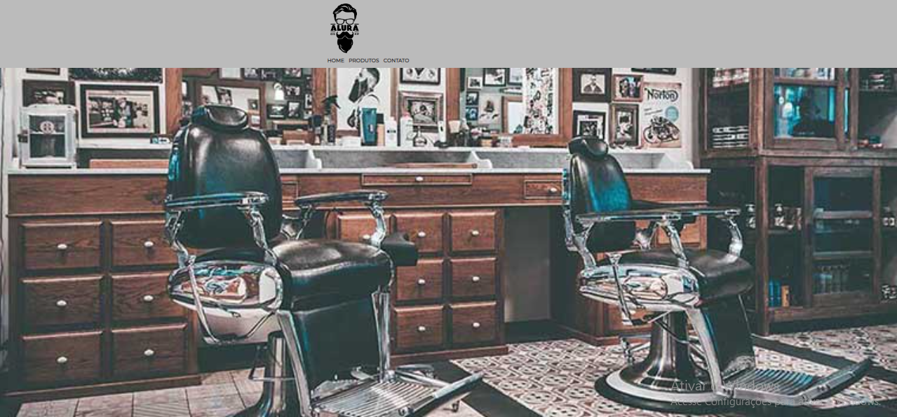

#   Projeto site "Barbearia Alura"

## Descrição:
Projeto, pondo em prática meus conhecimentos em HTML e CSS, e
conforme o desenvolvimento das aulas, fui me capacitando e aprimorando meus conhecimentos nas linguagens.

[🔗 Clique aqui para acessar](https://marcos-franco.github.io/site-barbearia/)

## 🛠 Tecnologias:
- HTML
- CSS
- Git
- Github

## Status do Projeto:
100% Concluído

## Autor:
Projeto desenvolvido por [Marcos Franco](https://www.linkedin.com/in/marcosfranco-5b1a8a111/)

## 💛 Contatos:

Linkedin: https://www.linkedin.com/in/marcosfranco-5b1a8a111/

Repositório Github: https://github.com/marcos-franco

WhatSapp: https://contate.me/marcos-franco

E-mail: masf68@hotmail.com
